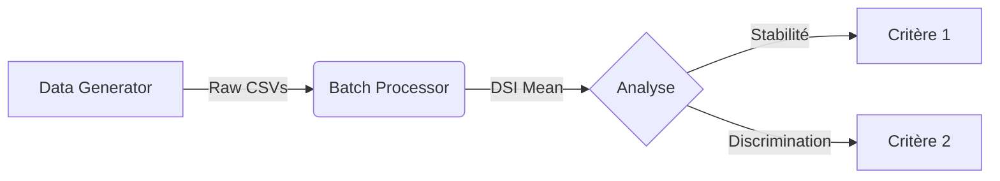

# Analyse Statistique de la Compressibilité Gingivale (In Vivo)

Ce projet de thèse vise à développer et valider une méthode de **quantification de la compressibilité des tissus mous** (gencive) par scanner intra-oral. 

L'objectif est double : valider la fiabilité de l'instrument (Critère 1) et sa capacité à distinguer les tissus sains des tissus mous/infiltrés (Critère 2).

---

## 🔄 Pipeline de Traitement des Données

Le projet est structuré en modules séquentiels simulant l'acquisition et le traitement clinique :



### 1. Génération de Données (`data_generator.py`)
Simule des cohortes de patients virtuels à partir d'un scan maître (`dpi_height.csv`).
*   Génère les dossiers `batch_XXX`.
*   Simule le bruit de capteur et les artéfacts de mouvement.
*   Simule la déformation des tissus sous pression (Gradient étendu).

### 2. Traitement des Scans (`batch_processor.py`)
Nettoie et fusionne les données brutes :
*   **Fusion Multi-Angles** : Combine 5 prises de vue pour combler les zones d'ombre (Min-Composite).
*   **Moyennage Statistique** : Calcule le scan moyen (`dsi_mean`) à partir de 7 répétitions pour réduire le bruit aléatoire.

---

## 🔬 Critères d'Évaluation

### [Critère 1 : Stabilité & Reproductibilité](./critere_1/)
**"Est-ce que l'appareil mesure toujours la même chose ?"**
*   **Analyse** : Calcul de l'écart-type local ($\sigma$) pixel par pixel sur les 7 répétitions.
*   **Visualisation** : 
    *   **Histogramme Empilé** : Distribution de l'instabilité par échantillon.
    *   **Heatmap 3D** : Projection de l'instabilité sur l'anatomie réelle du patient pour localiser les erreurs.
*   **Objectif** : Instabilité moyenne < 20 µm.

### [Critère 2 : Discrimination Tissulaire](./critere_2/)
**"Est-ce que l'appareil voit la différence entre os et gencive ?"**
*   **Analyse** : Comparaison de la dépressibilité entre une zone dure (Crête) et une zone molle (Vestibule), identifiées automatiquement par analyse géométrique.
*   **Indicateur** : Ratio Signal-sur-Bruit (SNR).
*   **Visualisation** : Heatmap 3D (Rouge = Mou, Bleu = Dur).

---

## 🚀 Guide de Démarrage Rapide

1.  **Installation**
    ```bash
    # Créer un venv
    python -m venv .venv
    source .venv/bin/activate
    pip install numpy pandas scipy matplotlib seaborn
    ```

2.  **Génération des Données** (Optionnel si déjà fait)
    ```bash
    python data_generator.py
    ```

3.  **Traitement des Lots**
    ```bash
    python batch_processor.py
    ```

4.  **Lancer les Analyses**
    ```bash
    # Analyse de Stabilité
    cd critere_1
    python generate_thesis_report.py

    # Analyse de Discrimination
    cd ../critere_2
    python run_critere2.py
    ```

---

## 📂 Structure du Répertoire

*   `batch/` : Données générées (ne pas modifier manuellement).
*   `critere_1/` : Scripts d'analyse de variance et rapports de stabilité.
*   `critere_2/` : Scripts d'extraction de zones et calcul de SNR.
*   `rapport_figures*` : Dossiers de sortie contenant les graphiques générés.
